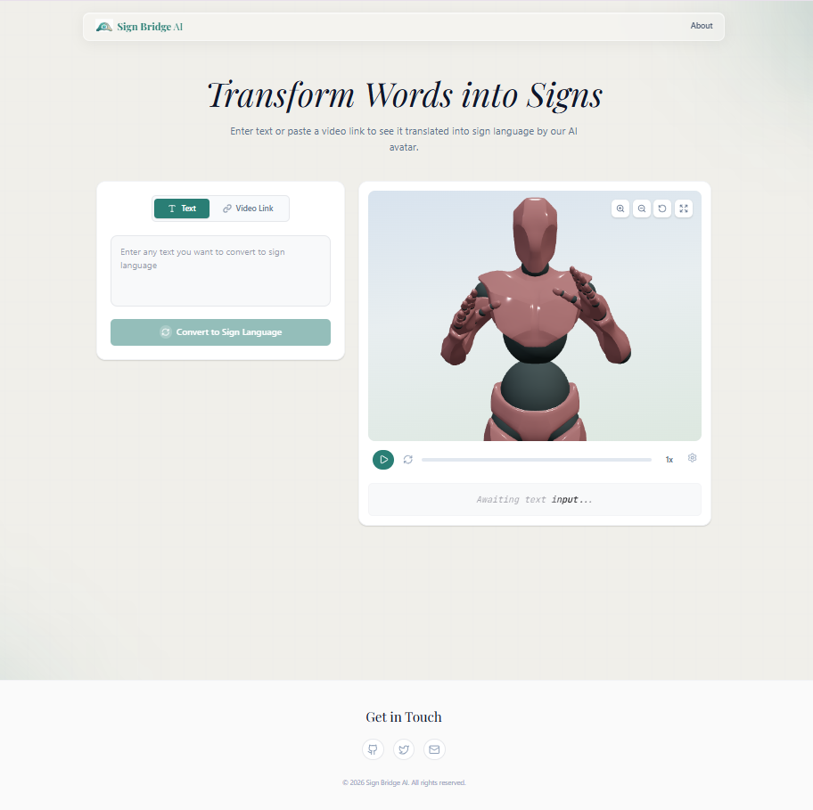
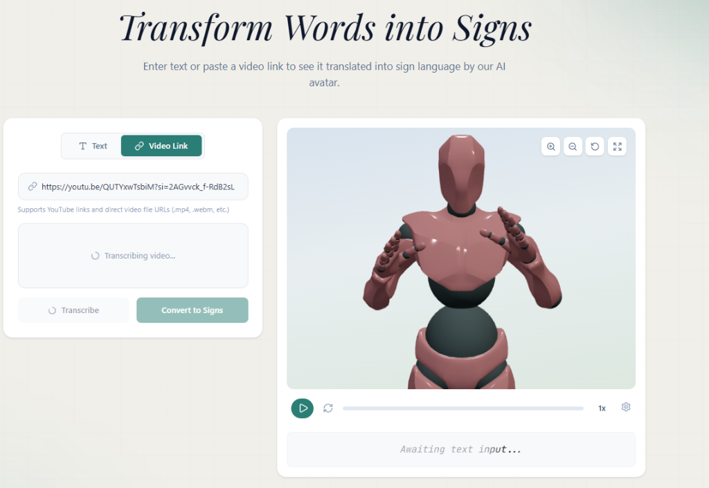
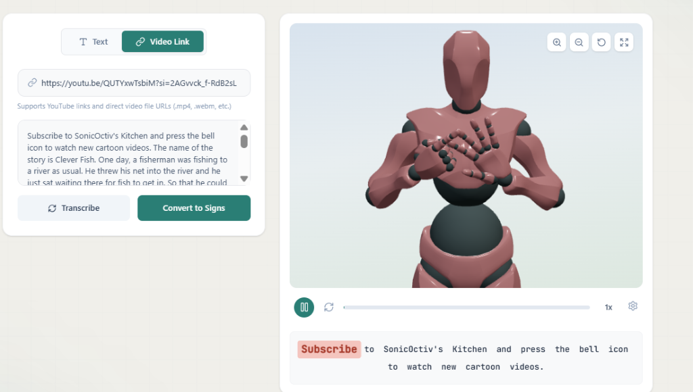

<div align="center">
  
  <h1>SignBridge AI</h1>
  <p><strong>Bridging the communication gap with an AI-powered 3D Sign Language Translator</strong></p>
  
  [](frontend/)
  [](backend/)
  [](backend/)
</div>

<br />

## 🌟 Overview

**SignBridge** is a cutting-edge web application designed to automatically translate audio and video content into realistic 3D sign language animations in real-time. By leveraging state-of-the-art AI models, SignBridge makes digital content more accessible to the Deaf and Hard of Hearing community.

The system can extract audio from URLs (like YouTube videos), accurately transcribe the speech to text, translate that text into sign language grammar using Large Language Models, and seamlessly animate a 3D avatar to sign the generated sequence.

## ✨ Features

- **📺 URL-to-Sign Translation**: Paste a video URL, and watch the avatar sign the spoken content!
- **🗣️ Advanced Speech Recognition**: Powered by Faster-Whisper for high-speed, highly accurate transcription.
- **🧠 Intelligent Translation**: Uses a local Ollama instance (Mistral) to accurately convert conversational English into ASL grammar structures.
- **🕺 Real-time 3D Avatar**: Beautiful, smooth 3D animations using Three.js and custom avatar models (including Ready Player Me integration).
- **🔒 Privacy First**: All AI models (Whisper, LLMs) run entirely locally.

## 🏗️ Architecture

SignBridge is built on a modern, decoupled architecture:

### Frontend
- **Framework**: React.js with Vite
- **3D Rendering**: Three.js & React Three Fiber
- **Styling**: Tailwind CSS / Vanilla CSS
- **Features**: Interactive avatar controls, real-time transcription display, responsive UI.

### Backend
- **Framework**: FastAPI (Python)
- **Audio Extraction**: `yt-dlp` & FFmpeg
- **Transcription**: `faster-whisper`
- **Translation**: `Ollama` running Mistral locally

---

## 🚀 Getting Started

Follow these instructions to get a copy of the project up and running on your local machine.

### Prerequisites

- **Node.js** (v18+)
- **Python** (3.10+)
- **FFmpeg**: Must be installed and added to your system PATH.
- **Ollama**: Download from [ollama.com](https://ollama.com) and pull the mistral model (`ollama pull mistral`).

### 1. Clone the repository
```bash
git clone https://github.com/Roza212/SignBridge.git
cd SignBridge
```

### 2. Backend Setup
```bash
cd backend/backend

# Create a virtual environment
python -m venv .venv

# Activate it (Windows)
.\.venv\Scripts\activate

# Install dependencies
pip install -r requirements.txt

# Start the FastAPI server
python -m uvicorn app.main:app --reload --port 8000
```
*The backend will be running at `http://localhost:8000`*

### 3. Frontend Setup
Open a new terminal window:
```bash
cd frontend

# Install Node modules
npm install

# Start the Vite development server
npm run dev
```
*The frontend will be running at `http://localhost:5173`*

---

## 📸 Usage & Screenshots

SignBridge offers two primary modes of translation:

### 1. Text to Sign
Type directly into the input field to watch the avatar sign conversational text.
<br/>

<br/>

### 2. Video to Sign
Paste a valid YouTube URL. The backend will securely extract the audio, transcribe the speech, and translate it into ASL.
<br/>

<br/>
Watch the 3D avatar sign the video content in real-time alongside the highlighted transcription!
<br/>

<br/>


## 📄 License

This project is licensed under the MIT License - see the LICENSE file for details.
